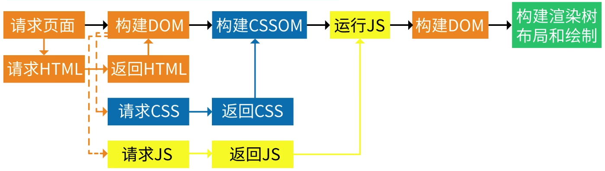

# 浏览器
## 1.浏览器展示html文件的过程



1. HTML内容被HTML解析器解析生成DOM树

2. CSS内容被CSS解析器解析生产CSSOM树（CSSOM树生成之后开始执行js文件暂定DOM树解析）

3. DOM树+CSSOM树会生产Render Tree（渲染树）
4. 生成布局，浏览器根据渲染树来布局，以计算每个节点的几何信息
5. 将各个节点绘制到屏幕上

## 2.重排与重绘

- 重绘：元素的外观被改变，例如：元素的背景颜色发生变化
- 重排：重新生成布局，重新排列元素，例如：元素的尺寸、位置发生变化

### 2.1 重排(Reflow)

> 当DOM的变化影响了元素的几何信息(元素的的位置和尺寸大小)，浏览器需要重新计算元素的几何属性，将其安放在界面中的正确位置，这个过程叫做**重排**。

*重排也叫做**回流***

**重排的代价是高昂的，会破坏用户体验，并且让UI展示非常迟缓，重排重绘非常耗费资源，是导致网页性能低下的根本原因。**

我们应尽量减少重排，最简单的方式是：

1. 缩小重排范围

   - 应该尽量以局部布局的形式组织HTML结构，使各个结构间相互独立，当某个结构发生重排时，不会影响到页面上的其它结构
   - 应该尽可能在底层级的元素上设置样式，削弱修改样式时，对页面其它元素带来影响
   - 不要使用table布局，可能很小的一个小改动会造成整个table的重新布局

2. 减少重排次数

   - 通过`documentFragment`创建一个 `dom` 碎片,在它上面批量操作 `dom`，操作完成之后，再添加到文档中，这样只会触发一次重排
   - 使用 absolute 或 fixed 脱离文档流：使用 `absolute` 或 `fixed` 脱离文档流使用绝对定位会使的该元素单独成为渲染树中 `body` 的一个子元素，重排开销比较小，不会对其它节点造成太多影响

   - 分离读写操作：DOM 的多个读操作（或多个写操作），应该放在一起。不要两个读操作之间，加入一个写操作

     ```javascript
     // bad 强制刷新 触发四次重排+重绘
     div.style.left = div.offsetLeft + 1 + 'px';
     div.style.top = div.offsetTop + 1 + 'px';
     div.style.right = div.offsetRight + 1 + 'px';
     div.style.bottom = div.offsetBottom + 1 + 'px';
     
     
     // good 缓存布局信息 相当于读写分离 触发一次重排+重绘
     var curLeft = div.offsetLeft;
     var curTop = div.offsetTop;
     var curRight = div.offsetRight;
     var curBottom = div.offsetBottom;
     ```

### 2.2 重绘(Repaints)

> 当一个元素的外观发生改变，但没有改变布局，浏览器重新把元素的外观绘制出来的过程，叫做**重绘**。

**`重排必定会引发重绘，但重绘不一定会引发重排`**

## 3. 浏览器的渲染过程以及网页性能优化

**渲染过程**

1. 解析 HTML：浏览器会将 HTML 代码解析成 DOM 树，根据 DOM 结构创建节点对象，同时解析 CSS 和 JavaScript，生成 CSSOM 和 JavaScript 对象模型。
2. 构建渲染树：浏览器会根据 DOM 和 CSSOM 构建渲染树，它是由可见的文档对象组成的树形结构，其中每个节点都是一个渲染对象。
3. 布局和绘制：浏览器会根据渲染树的结构和样式信息进行布局和绘制。布局是指计算出每个节点在屏幕上的位置和大小，绘制是指将节点的内容绘制在屏幕上。这个过程也称为“重排”和“重绘”。
4. 合成和显示：浏览器会将绘制好的图像传递给 GPU，GPU 会将图像合成为页面，并在屏幕上显示出来。

**优化**

1. 减少 DOM 操作和重绘：DOM 操作和重绘会触发浏览器的渲染过程，因此过多的操作会影响性能。可以通过一些技术，如事件委托、批量修改样式等来减少操作次数。
2. 使用 CSS3 动画和过渡：CSS3 动画和过渡可以由浏览器的 GPU 加速，因此比 JavaScript 动画性能更好。
3. 压缩和合并代码：将多个 CSS 或 JavaScript 文件压缩和合并成一个文件，可以减少请求次数和文件大小。
4. 使用缓存：将静态资源缓存在客户端，可以减少请求次数和带宽占用，提高网站的访问速度。
5. 优化图片：使用合适的图片格式和压缩算法，可以减少图片大小和加载时间。

## 4.常见网络请求状态码

1. **200** OK：表示服务器成功处理了请求，并返回对应的资源。
2. **301** Moved Permanently：表示请求的资源已被永久移动到新位置，客户端需要使用新的URL进行访问。
3. **302** Found：表示请求的资源已被暂时移动到新位置，客户端需要使用新的URL进行访问。与301状态码不同之处在于，302状态码表示资源只是暂时被移动，将来可能会恢复原来的位置。
4. **400** Bad Request：表示客户端发出了一个错误的请求，服务器无法理解。
5. **401** Unauthorized：表示请求未经授权，需要有效的身份验证才能访问所需的资源。
6. **403** Forbidden：表示服务器拒绝了客户端的请求，因为客户端没有访问该资源的权限。
7. **404** Not Found：表示请求的资源在服务器上不存在。
8. **500** Internal Server Error：表示服务器在处理请求时发生了意外的错误，导致无法完成客户端的请求。

## 5. TCP和UDP协议

TCP（传输控制协议）和UDP（用户数据报协议）是两种常用的互联网传输协议。

TCP是一种面向连接、可靠的传输协议，它通过三次握手建立连接，并且在数据传输过程中进行错误校验和重传，确保数据的准确性和完整性。TCP适用于对数据传输质量要求较高的场景，如文件传输、电子邮件等。

UDP是一种无连接、不可靠的传输协议，它不需要建立连接和维护状态，只是简单地将数据包发送出去，因此速度相对较快，但可能会存在数据传输丢失或乱序的情况。UDP适用于实时通信和流媒体等场景，如在线游戏、视频直播等。

## .6 说说跨域问题
   
跨域是指浏览器的同源策略限制下，一个域下的网页无法获取另一个域下的资源。这里的 “域” 指的是协议、域名、端口都相同。
跨域问题产生的原因主要是出于浏览器的安全考虑，防止恶意网站通过脚本获取其他网站的敏感信息。
**常见的跨域解决方案有以下几种：**
1. JSONP：利用 `<script>` 标签的跨域能力，通过动态创建 `<script>` 标签并指定回调函数来获取数据。但只能支持 GET 请求。
2. CORS（跨域资源共享）：这是一种规范，服务器通过在响应头中设置特定字段，如 Access-Control-Allow-Origin 等，来允许跨域请求。支持各种 HTTP 方法。
3. 代理服务器：通过在同源的服务器端转发请求，来规避浏览器的跨域限制。