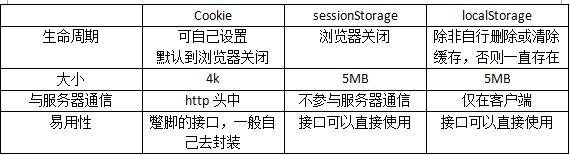

# 代码实现
| 链接地址                                                                                                        |
| --------------------------------------------------------------------------------------------------------------- |
| [vue.config.js 的配置项](https://www.jianshu.com/p/b358a91bdf2d)                                                |
| [Vue 指令大全](https://www.jianshu.com/p/c4a87e1b4ef7)                                                          |
| [VueX 和 EventBus 的区别和使用场景](https://www.jianshu.com/p/5628bb944571)                                     |
| [forEach、filter、map 间的区别以及使用场景](https://zhuanlan.zhihu.com/p/291089608)                             |
| [cookie、sessionStorage 和 localStorage 的区别](https://blog.csdn.net/weixin_42614080/article/details/90706499) |
|                                                        |

## 1.实现一个节流函数， 最后一次必须执行

```javascript
function throttle(fn, delay) {
  let timer = null;
  let lastExecTime = 0;
  return function(...args) {
    const currTime = Date.now();
    const timeSinceLastExec = currTime - lastExecTime;
    if (!timer || timeSinceLastExec >= delay) {
      lastExecTime = currTime;
      clearTimeout(timer);
      timer = null;
      fn.apply(this, args);
    } else if (!timer) {
      timer = setTimeout(() => {
        lastExecTime = Date.now();
        timer = null;
        fn.apply(this, args);
      }, delay - timeSinceLastExec);
    }
  };
}
```

## 2.去除字符串中出现次数最少的字符，不改变原字符串的顺序。

```javascript
let str = "aaababdee";
function removeLeast(str) {
  const charCount = str.split("").reduce((count, char) => {
    count[char] = count[char] ? count[char] + 1 : 1;
    return count;
  }, {});
  console.log(charCount);
  const leastCount = Math.min(...Object.values(charCount));
  return str
    .split("")
    .filter((char) => charCount[char] !== leastCount)
    .join("");
}

console.log(removeLeast(str)); // aaababee
```


# Css

