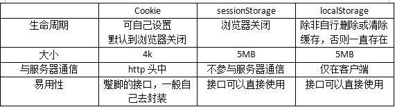

# 面试题

| 链接地址                                                                                                        |
| --------------------------------------------------------------------------------------------------------------- |
| [vue.config.js 的配置项](https://www.jianshu.com/p/b358a91bdf2d)                                                |
| [Vue 指令大全](https://www.jianshu.com/p/c4a87e1b4ef7)                                                          |
| [VueX 和 EventBus 的区别和使用场景](https://www.jianshu.com/p/5628bb944571)                                     |
| [forEach、filter、map 间的区别以及使用场景](https://zhuanlan.zhihu.com/p/291089608)                             |
| [cookie、sessionStorage 和 localStorage 的区别](https://blog.csdn.net/weixin_42614080/article/details/90706499) |
|                                                        |

# Vue

## 1. 为什么 data 是个函数并且返回一个对象呢？

> `data`之所以是一个函数，是因为一个组件可能会多处调用，而每一次调用就会执行`data函数`并返回新的数据对象，这样，可以避免多处调用之间的`数据污染`。

## 2. 子父生命周期顺序

**创建阶段**

父（beforeCreate） => 父 （created）=> 父（beforeMount） => 子（beforeCreate） => 子（created） => 子（beforeMount） => 子（Mounted） => 父（Mounted）

**更新阶段**

父（beforeUpdate） => 子（beforeUpdate） => 子（updated） => 父（updated）

**销毁阶段**

父（beforeDestroy） => 子（beforeDestroy） => 子（destroyed） => 父（destroyed）

## 3. 组件之间传值

emit、props、ref、$parent、$children、eventBus、provide/inject、vuex

## 4. vue优缺点

优点：渐进式，组件化，轻量级，虚拟dom，响应式，单页面路由，数据与视图分开

缺点：单页面不利于seo，不支持IE8以下，首屏加载时间长

## 5. 为什么v-if和v-for不建议用在同一标签？

在Vue2中，`v-for`优先级是高于`v-if`的

例子：

```js
<div v-for="item in [1, 2, 3, 4, 5, 6, 7]" v-if="item !== 3">
    {{item}}
</div>
```

上面的写法是`v-for`和`v-if`同时存在，会先把7个元素都遍历出来，然后再一个个判断是否为3，并把3给隐藏掉，这样的坏处就是，渲染了无用的3节点，增加无用的dom操作，建议使用computed来解决这个问题。

**在vue3中v-if优先级高于v-for，所以他们混用时会直接报错！**

## 6.自定义v-model

默认情况下，v-model 是 @input 事件侦听器和 :value 属性上的语法糖。但是，你可以在你的Vue组件中指定一个模型属性来定义使用什么事件和value属性

```javascript
export default: {
  model: {
    event: 'change',
    prop: 'checked'  
  }
}
```


# vue-router

## 1. Hash 和 History 的区别

> 对于现代开发的项目来说，稍微复杂一点的 `SPA` ，都需要用到**路由**。而 `vue-router` 正是 `vue` 的路由标配，且 `vue-router` 有**两种模式**： `hash` 和 `history` 。

### 1.1 Hash 模式

> `hash` 模式是一种把前端路由的路径用井号 `#` 拼接在真实 `url` 后面的模式。当井号 `#` 后面的路径发生变化时，浏览器并不会重新发起请求，而是会触发 `onhashchange` 事件。

**特点：**

- `hash` 变化会触发网页跳转，即浏览器的前进和后退。
- `hash` 可以改变 `url` ，但是不会触发页面重新加载（hash 的改变是记录在 `window.history` 中），即不会刷新页面。
- **`hash` 通过 `window.onhashchange` 的方式，来监听 `hash` 的改变，借此实现无刷新跳转的功能。**
- `hash` 永远不会提交到 `server` 端

### 1.1.1 url 的属性

|       属性        |   含义   |
| :---------------: | :------: |
| location.protocal |   协议   |
| location.hostname |  主机名  |
|   location.host   |   主机   |
|   location.port   |  端口号  |
| location.pathname | 访问页面 |
|  location.search  | 搜索内容 |
|   location.hash   |  哈希值  |

**示例：**

```javascript
//http://127.0.0.1:8001/01-hash.html?a=100&b=20#/aaa/bbb
location.protocal; // 'http:'
localtion.hostname; // '127.0.0.1'
location.host; // '127.0.0.1:8001'
location.port; //8001
location.pathname; //'01-hash.html'
location.serach; // '?a=100&b=20'
location.hash; // '#/aaa/bbb'
```

## 1.2 History 模式

> `history API` 是 `H5` 提供的新特性，允许开发者**直接更改前端路由**，即更新浏览器 `URL` 地址而**不重新发起请求**。

**特点：**

- 新的 `url` 可以是与当前 `url` 同源的任意 `url` ，也可以是与当前 `url` 一样的地址，但是这样会导致的一个问题是，会把**重复的这一次操作**记录到栈当中。

- 通过 `history.state` ，添加任意类型的数据到记录中。

- 可以额外设置 `title` 属性，以便后续使用。

- **通过 `pushState` 、 `replaceState` 来实现无刷新跳转的功能**。

### 1.2.1 History API

|                   API                   |                                                                                                                                                                                           |
| :-------------------------------------: | :---------------------------------------------------------------------------------------------------------------------------------------------------------------------------------------: |
|  history.pushState(data, title[, url])  | 主要用于往历史记录堆栈顶部添加一条记录，data：会在 onpopsate 事件触发时作为参数传递过去，title：为页面标题，当前所有浏览器都会忽略此参数，url：为页面地址，可选，缺少时表示为当前页面地址 |
| history.replaceState(data, title[,url]) |                                                                               更改当前的历史记录，参数同上                                                                                |
|              history.state              |                                                                 用于存储以上方法的 data 数据，不同浏览器的读写权限不一样                                                                  |
|            window.onpopstate            |                                                        点击浏览器前进、后退以及调用 history.go,history.back,history.forward 会触发                                                        |

# vuex

## 1. vuex的有哪些属性？

- State：定义了应用状态的数据结构，可以在这里设置默认的初始状态。
- Getter：允许组件从 Store 中获取数据，mapGetters 辅助函数仅仅是将 store 中的 getter 映射到局部计算属性。
- Mutation：是唯一更改 store 中状态的方法，且必须是同步函数。
- Action：用于提交 mutation，而不是直接变更状态，可以包含任意异步操作。
- Modules：允许将单一的 Store 拆分为多个 store 且同时保存在单一的状态树中。

# JavaScript

## 1.JavaScript 的数据类型

公共有 7 种数据类型分为：

**基本数据类型：**`string`、`number`、`boolean`、`null`、`undefined`、`symbol`(ES6 新增，创建之后第独一无二不可以改变的数据类型)

**引用数据类型：**`Object`

## 2. new 操作符做了什么事情

1. 创建一个新对象
2. 设置原型，将对象的原型设置为函数的 prototype 对象
3. 让函数的 this 指向这个对象，执行构造函数的代码（为这个对象添加属性）
4. 绑定函数的返回值类型，如果是值类型，返回创建的对象，如果是引用类型，就返回这个引用类型的对象

```javascript
/*
  myNew函数要接收不定量的参数，第一个参数是构造函数（也就是new操作符的目标函数），其余参数被构造函数使用。
  new myNew() 是一种js语法糖。我们可以用函数调用的方式模拟实现
*/
function myNew(Fn, ...args) {
  // 1、创建一个空的对象
  let obj = {}; // let obj = Object.create({});
  // 2、将空对象的原型prototype指向构造函数的原型
  Object.setPrototypeOf(obj, Fn.prototype); // obj.__proto__ = Fn.prototype
  // 以上 1、2步还可以通过 const obj = Object.create(Fn.prototype) 实现
  // 3、改变构造函数的上下文（this）,并将参数传入
  let result = Fn.apply(obj, args);
  // 4、如果构造函数执行后，返回的结果是对象类型，则直接将该结果返回，否则返回 obj 对象
  return result instanceof Object ? result : obj;
  // return typeof result === 'object' && result != null ? result : obj
}
```

## 3. 什么是闭包，闭包的作用是什么

> 闭包：当一个内部函数被调用，就会形成闭包，闭包就是能够读取其他函数内部变量的函数。
>
> 作用：
>
> 1.封装变量：闭包可以封装变量，防止变量被外部访问和修改，从而实现数据的私有化和保护。
>
> 2.延长变量的生命周期：当函数执行完毕后，其内部的变量通常会被销毁，但是如果该函数返回了一个闭包，那么该闭包就可以一直访问和使用这些变量，从而延长了它们的生命周期。
>
> 3.实现函数的柯里化：闭包可以实现函数的柯里化，即将一个多参数的函数转换成一个单参数的函数序列，这样可以更加灵活地使用函数。
>
> 4.实现模块化：通过使用闭包，可以实现模块化的编程方式，将函数和变量封装在一个作用域内，避免了命名冲突和全局变量的污染。
>
> **过度使用闭包可能会导致内存泄漏和性能问题，因此需要谨慎使用。**

## 4. Promise 是什么

> `Promise` 是异步编程的一种解决方案,从语法上讲,`Promise`是一个对象,从它可以获取异步操作的消息,本意上讲,它是承诺,承诺它过一段时间会给你一个结果.`Promise`有三种状态: `pending`(等待),fulfiled(成功),rejected(失败),状态一旦改变就不会再变.创建 promise 实例后它会立即执行.

## 5.null 和 undefined 的不同

- `null`：没有对象，表示该处不应该有值

- `undefined`：缺少值，该处应该有一个值，但还没用定义
- `null`转换为数值为 0，`undefined`转换为数字为 NaN(不是一个数字)

什么时候为`null`：

- 作为函数的参数，表示该函数的参数为空。
- 作为对象原型链的终点。

什么时候会出现`undefined`：

- 变量被声明了，但没有赋值。
- 调用函数时，应该提供的参数没有提供。
- 对象没有赋值的属性
- 函数没有返回值时，默认`undefined`

```javascript
null == undefined; // ture
null === undefined; // false
```

## 6.js 运行机制

因为 js 是单线程的只有一个调用栈，调用栈按照先入后出的规则进行，一次只调用一个，调用栈会先执行同步代码，当调用栈发现异步代码时会先将他归为异步队列，异步队列分为 **宏任务队列** 和 **微任务队列**，进入队列的代码会按照先入先出的顺序执行。

**宏任务队列**：新程序执行或是子程序被执行（也就是一个`script`标签元素里边运行的代码）、定时函数、事件回调函数，文件操作

**微任务队列：**Promise.then().catch().finally()、MutationObserver、Object.observe

他们的运行是通过 **事件循环（Event Loop）** 不断地寻找可以执行的任务来执行，首先会先执行一下宏任务因为 `script` 就属于宏任务，之后执行完同步的任务后（清空调用栈之后），**先执行微任务队列**中的任务，把微任务队列的任务**清空**以后，**再执行宏任务队列**中的任务

_在执行宏任务时如果出现了新的微任务那么执行完当前的宏任务之后会继续去执行微任务，等清空微任务队列之后才会接着执行刚才的宏任务_

代码示例：

```html
<script>
  console.log("程序执行");
  setTimeout(() => {
    console.log("4");
  }, 100);
  setTimeout(() => {
    console.log("1");
    Promise.resolve().then(() => {
      console.log("3");
    });
    console.log("2");
  }, 0);
</script>
```

运行结果：

```
程序执行
1
2
3
4
```

## 7.普通函数和箭头函数的区别

### 1.this 指向

在普通函数中 this 指向（执行上下文）是动态的，取决于函数是如何被调用的，谁调用 this 就指向谁。

无论何时执行或在何处执行，箭头函数内部的 this 都指向的是外部函数，即箭头函数不会改变 this 的指向，也可以理解未箭头函数中没有 this。

注意：由于**箭头函数没有自己的 this 指针**，通过 call() 、 apply() 和 bind() 方法调用时，只能传递参数，而不能绑定 this，他们的第一个参数会被忽略。

### 2.构造函数

在 JavaScript 中，函数和类的继承是通过 prototype 属性实现的，且 prototype 拥有属性 constructor 指向构造函数，如下：

```javascript
function fnc() {}
console.lof(fnc.prototype); // {constructor: ƒ}
```

而采用箭头函数定义函数时，其是没有 prototype 属性的，也就无法指向构造函数。

```javascript
const arrowFnc = () => {};

console.log(arrowFnc.prototype); // undefined
```

### 3.参数

在普通函数中可以使用 arguments 对象获取函数参数

```javascript
function fun() {
  console.log(arguments);
}
fun(1, 2, 3); // Arguments(3)[1,2,3]
```

在箭头函数中没有 arguments 对象，不过可以使用...args

```javascript
const fun = () => {
  console.log(arguments);
};
fun(1, 2, 3); // Error: arguments is not defined

const fun = (...args) => {
  console.log(args);
};
fun(1, 2, 3); // [1,2,3]
```

### 4.返回值

在处理函数的返回值时，相比于普通函数，箭头函数可以隐式返回。

```javascript
const sum = (a, b) => {
  return a + b;
};
const sum = (a, b) => a + b;
```

## 8.显式原型和隐式原型

显式原型：`prototype`

隐式原型：`__proto__`

只有**函数**才有**显式原型**（`prototype`），它指向的是一个**Object 空对象** ，原型对象`prototype`中有一个`constructor`属性，它指向函数对象本身；

每个**实例对象**都有**隐式原型**（`__proto__`），**隐式原型**指向的是它上层的原型的**显式原型**

证实：

```javascript
function Fun() {}
const fun = new Fun();
const str = "";

//证明只有函数才有显式原型
console.log(Fun.prototype); // {}
console.log(fun.prototype); // undefied
console.log(str.prototype); // undefied

// 证明函数的显式原型指向的是一个Object 空对象
console.log(typeof Fun.prototype === "object", Object.keys(Fun.prototype)); // true, []
// 原型对象prototype中有一个constructor属性，它指向函数对象本身
console.log(Fun.prototype.constructor === Fun);

// 证明隐式原型指向的是它上层的原型的显式原型
console.log(Fun.__proto__ === Function.prototype); // true
console.log(fun.__proto__ === Fun.prototype); // true
console.log(str.__proto__ === String.prototype); // true
```

## 9. call、apply、bind区别

**相同**：他们三个都属于函数的方案，用于改变函数内部this的指向

| 方法    | 函数执行时机 | 传参方式                           |
| ------- | ------------ | ---------------------------------- |
| call()  | 立即执行     | (this指向对象,参数1,参数2,参数3)   |
| apply() | 立即执行     | (this指向对象,[参数1,参数2,参数3]) |
| bind()  | 返回当前函数 | (this指向对象,参数1,参数2,参数3)   |

# 浏览器

## 1.浏览器展示html文件的过程


1. HTML内容被HTML解析器解析生成DOM树

2. CSS内容被CSS解析器解析生产CSSOM树（CSSOM树生成之后开始执行js文件暂定DOM树解析）

3. DOM树+CSSOM树会生产Render Tree（渲染树）
4. 生成布局，浏览器根据渲染树来布局，以计算每个节点的几何信息
5. 将各个节点绘制到屏幕上

## 2.重排与重绘

- 重绘：元素的外观被改变，例如：元素的背景颜色发生变化
- 重排：重新生成布局，重新排列元素，例如：元素的尺寸、位置发生变化

### 2.1 重排(Reflow)

> 当DOM的变化影响了元素的几何信息(元素的的位置和尺寸大小)，浏览器需要重新计算元素的几何属性，将其安放在界面中的正确位置，这个过程叫做**重排**。

*重排也叫做**回流***

**重排的代价是高昂的，会破坏用户体验，并且让UI展示非常迟缓，重排重绘非常耗费资源，是导致网页性能低下的根本原因。**

我们应尽量减少重排，最简单的方式是：

1. 缩小重排范围

   - 应该尽量以局部布局的形式组织HTML结构，使各个结构间相互独立，当某个结构发生重排时，不会影响到页面上的其它结构
   - 应该尽可能在底层级的元素上设置样式，削弱修改样式时，对页面其它元素带来影响
   - 不要使用table布局，可能很小的一个小改动会造成整个table的重新布局

2. 减少重排次数

   - 通过`documentFragment`创建一个 `dom` 碎片,在它上面批量操作 `dom`，操作完成之后，再添加到文档中，这样只会触发一次重排
   - 使用 absolute 或 fixed 脱离文档流：使用 `absolute` 或 `fixed` 脱离文档流使用绝对定位会使的该元素单独成为渲染树中 `body` 的一个子元素，重排开销比较小，不会对其它节点造成太多影响

   - 分离读写操作：DOM 的多个读操作（或多个写操作），应该放在一起。不要两个读操作之间，加入一个写操作

     ```javascript
     // bad 强制刷新 触发四次重排+重绘
     div.style.left = div.offsetLeft + 1 + 'px';
     div.style.top = div.offsetTop + 1 + 'px';
     div.style.right = div.offsetRight + 1 + 'px';
     div.style.bottom = div.offsetBottom + 1 + 'px';
     
     
     // good 缓存布局信息 相当于读写分离 触发一次重排+重绘
     var curLeft = div.offsetLeft;
     var curTop = div.offsetTop;
     var curRight = div.offsetRight;
     var curBottom = div.offsetBottom;
     ```

### 2.2 重绘(Repaints)

> 当一个元素的外观发生改变，但没有改变布局，浏览器重新把元素的外观绘制出来的过程，叫做**重绘**。

**`重排必定会引发重绘，但重绘不一定会引发重排`**

## 3. 浏览器的渲染过程以及网页性能优化

**渲染过程**

1. 解析 HTML：浏览器会将 HTML 代码解析成 DOM 树，根据 DOM 结构创建节点对象，同时解析 CSS 和 JavaScript，生成 CSSOM 和 JavaScript 对象模型。
2. 构建渲染树：浏览器会根据 DOM 和 CSSOM 构建渲染树，它是由可见的文档对象组成的树形结构，其中每个节点都是一个渲染对象。
3. 布局和绘制：浏览器会根据渲染树的结构和样式信息进行布局和绘制。布局是指计算出每个节点在屏幕上的位置和大小，绘制是指将节点的内容绘制在屏幕上。这个过程也称为“重排”和“重绘”。
4. 合成和显示：浏览器会将绘制好的图像传递给 GPU，GPU 会将图像合成为页面，并在屏幕上显示出来。

**优化**

1. 减少 DOM 操作和重绘：DOM 操作和重绘会触发浏览器的渲染过程，因此过多的操作会影响性能。可以通过一些技术，如事件委托、批量修改样式等来减少操作次数。
2. 使用 CSS3 动画和过渡：CSS3 动画和过渡可以由浏览器的 GPU 加速，因此比 JavaScript 动画性能更好。
3. 压缩和合并代码：将多个 CSS 或 JavaScript 文件压缩和合并成一个文件，可以减少请求次数和文件大小。
4. 使用缓存：将静态资源缓存在客户端，可以减少请求次数和带宽占用，提高网站的访问速度。
5. 优化图片：使用合适的图片格式和压缩算法，可以减少图片大小和加载时间。

## 4. 什么是BFC

BFC是块格式化上下文（Block Formatting Context）的缩写，它是Web页面中用于布局和定位HTML元素的一种CSS渲染机制。BFC是一个隔离的容器，在 BFC 内部，浮动元素会受到限制，即不会溢出容器，并且块级元素在垂直方向上按照一定规则排列，可以防止 margin 重叠等问题。

在BFC中，会创建新的块级格式化上下文，并定义了一些规则来控制其中元素的布局和表现。一些常见的创建BFC的方式包括：

- 根元素
- 浮动元素（float属性不为none）
- 绝对定位元素（position属性为absolute或fixed）
- display属性值为inline-block、table-cell、table-caption、flex、inline-flex等

BFC的作用在于可以帮助开发者更好地控制页面元素的布局和显示效果，减少因为元素相互干扰而产生的错误和布局问题。

## 5.常见网络请求状态码

1. **200** OK：表示服务器成功处理了请求，并返回对应的资源。
2. **301** Moved Permanently：表示请求的资源已被永久移动到新位置，客户端需要使用新的URL进行访问。
3. **302** Found：表示请求的资源已被暂时移动到新位置，客户端需要使用新的URL进行访问。与301状态码不同之处在于，302状态码表示资源只是暂时被移动，将来可能会恢复原来的位置。
4. **400** Bad Request：表示客户端发出了一个错误的请求，服务器无法理解。
5. **401** Unauthorized：表示请求未经授权，需要有效的身份验证才能访问所需的资源。
6. **403** Forbidden：表示服务器拒绝了客户端的请求，因为客户端没有访问该资源的权限。
7. **404** Not Found：表示请求的资源在服务器上不存在。
8. **500** Internal Server Error：表示服务器在处理请求时发生了意外的错误，导致无法完成客户端的请求。

## 6. TCP和UDP协议

TCP（传输控制协议）和UDP（用户数据报协议）是两种常用的互联网传输协议。

TCP是一种面向连接、可靠的传输协议，它通过三次握手建立连接，并且在数据传输过程中进行错误校验和重传，确保数据的准确性和完整性。TCP适用于对数据传输质量要求较高的场景，如文件传输、电子邮件等。

UDP是一种无连接、不可靠的传输协议，它不需要建立连接和维护状态，只是简单地将数据包发送出去，因此速度相对较快，但可能会存在数据传输丢失或乱序的情况。UDP适用于实时通信和流媒体等场景，如在线游戏、视频直播等。

# 代码实现

## 1.实现一个节流函数， 最后一次必须执行

```javascript
function throttle(fn, delay) {
  let timer = null;
  let lastExecTime = 0;
  return function(...args) {
    const currTime = Date.now();
    const timeSinceLastExec = currTime - lastExecTime;
    if (!timer || timeSinceLastExec >= delay) {
      lastExecTime = currTime;
      clearTimeout(timer);
      timer = null;
      fn.apply(this, args);
    } else if (!timer) {
      timer = setTimeout(() => {
        lastExecTime = Date.now();
        timer = null;
        fn.apply(this, args);
      }, delay - timeSinceLastExec);
    }
  };
}
```

## 2.去除字符串中出现次数最少的字符，不改变原字符串的顺序。

```javascript
let str = "aaababdee";
function removeLeast(str) {
  const charCount = str.split("").reduce((count, char) => {
    count[char] = count[char] ? count[char] + 1 : 1;
    return count;
  }, {});
  console.log(charCount);
  const leastCount = Math.min(...Object.values(charCount));
  return str
    .split("")
    .filter((char) => charCount[char] !== leastCount)
    .join("");
}

console.log(removeLeast(str)); // aaababee
```


# Css

