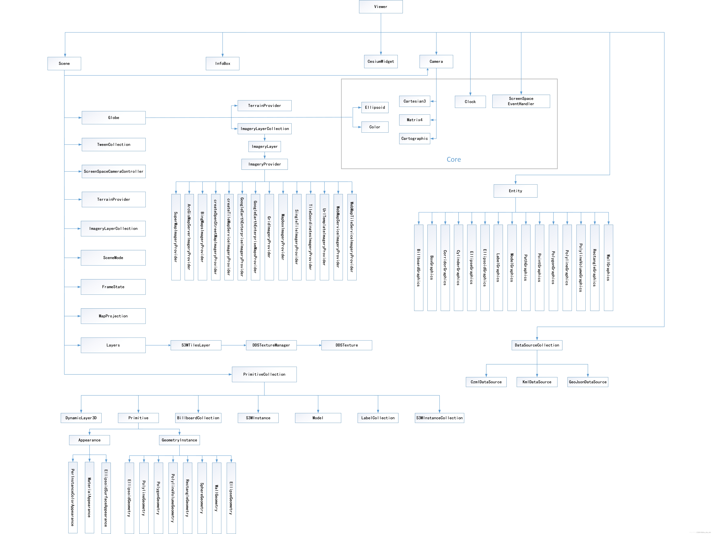

# cesium
## cesium对象结构


## 实现聚合效果
``` javascript

// 设置中国的经纬度范围
const longitudeMin = 73.5;
const longitudeMax = 135.0;
const latitudeMin = 18.0;
const latitudeMax = 53.0;
// 生成随机点位函数
function generateRandomPoints(count) {
  const points = [];
  for (let i = 0; i < count; i++) {
    const lon = longitudeMin + Math.random() * (longitudeMax - longitudeMin);
    const lat = latitudeMin + Math.random() * (latitudeMax - latitudeMin);
    points.push({
      longitude: lon,
      latitude: lat,
    });
  }
  return points;
}
// 生成点数据
const points = generateRandomPoints(10000);

// 创建支持聚类功能的数据源
const dataSource = new Cesium.CustomDataSource();
dataSource.clustering.enabled = true; // 启用聚类
dataSource.clustering.pixelRange = 40; // 聚合像素范围
dataSource.clustering.minimumClusterSize = 5; // 最小聚合数量

// 将数据源添加到Viewer
this.viewer.dataSources.add(dataSource);

// 添加点到数据源
points.forEach((point) => {
  dataSource.entities.add({
    position: Cesium.Cartesian3.fromDegrees(
      point.longitude,
      point.latitude
    ),
    billboard: {
      image: pointIcon, // 普通点图标
      width: 32,
      height: 32,
    },
  });
});
```

> 😛待编写...