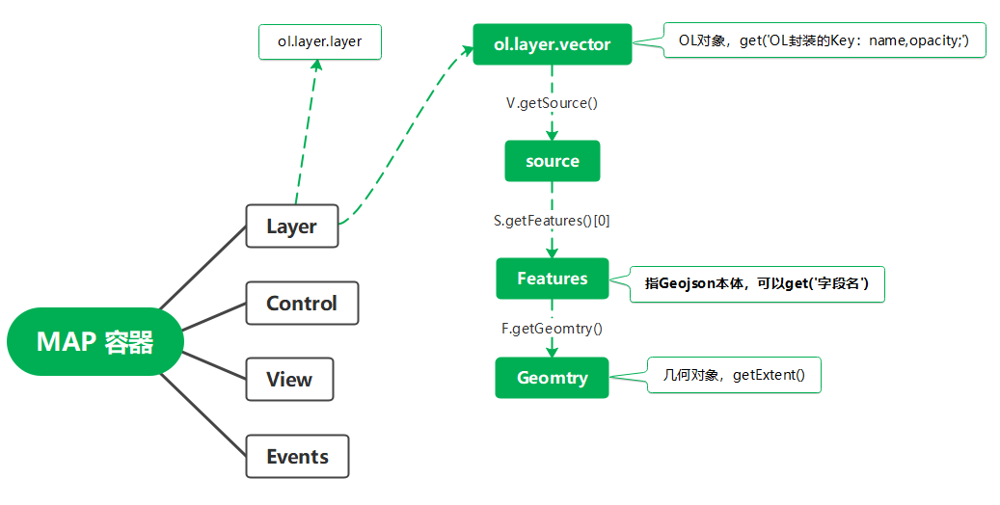

# openlayers
## openlayers对象结构


### 创建一个地图
```js
var map = new ol.Map({
  target: 'map',
  layers: [
    new ol.layer.Tile({
      source: new ol.source.OSM()
    })
  ],
  view: new ol.View({
    center: ol.proj.fromLonLat([108, 34]),
    zoom: 5
  })
});
```

## Layer对象的子类

### 1.瓦片图层（Tile Layers）
> 瓦片图层其原理是将整个地图区域划分为多个小的瓦片，根据地图的缩放级别和当前视图范围，只加载用户能看到的瓦片，从而提高地图的加载速度和性能。

**使用示例**
```js
let newLayer = new ol.layer.Tile({
  source: new ol.source.XYZ({
    url: '.../{z}/{x}/{y}'
  })
})
```

### 2.矢量图层（Vector Layers）
> 用于显示矢量数据，如点、线、面等地理要素。
> 
> 可以对矢量图层中的要素进行样式设置，如颜色、大小、线的宽度、填充色等。

**使用示例**
```js
let newLayer = new ol.layer.Vector({
  source: new ol.source.Vector({
    features: []
  })
})
```

### 3.影像图层（Image Layers）
> 用于显示单张的地图影响，通常是从一个服务或者本地文件获取的完整地图影像。与瓦片图层不同的是影像图层不是由多个小瓦片组成，而是一个整体图像。
> 
> 这种图层适用于展示高分辨率的遥感影像、航空照片等，不过他可能在处理大数据量的影像时性能不如瓦片图层，因为整个影像需要一次性加载。

**使用示例**
```js
let newLayer = new ol.layer.Image({
  source: new ol.source.ImageWMS({
    url: '...',
    params: {
      'FORMAT': 'image/png',
      'VERSION': '1.1.0'
    }
  })
})
```
## Source对象的子类
> Source 类是所有数据源的基类

### 1.矢量数据源（Vector）
> 用于加载矢量数据，如点、线、面等地理要素。
>
> 可以加载GeoJSON、KML、WKT等格式的数据。

**使用示例**
```js
let newLayer = new ol.layer.Vector({
  source: new ol.source.Vector({
    features: []
  })
})
```

### 2.XYZ图源（XYZ）
> 用于加载XYZ格式的地图瓦片数据。
>
> XYZ图源需要设置url模板，其中{x}、{y}、{z}分别代表瓦片的列号、行号和缩放级别。

**使用示例**
```js
let newLayer = new ol.layer.Tile({
  source: new ol.source.XYZ({
    url: '.../{z}/{x}/{y}'
  })
})
```
### 3.WMTS图源（WMTS）
> 用于加载和显示来自 WMTS 服务的地图图层。
>
> WMTS 的优点在于它的高效性和可扩展性，因为它可以通过请求图块的方式获取需要的数据，避免了每次请求都需要重新渲染完整地图的开销。

**使用示例**
```js
const wmtsSource = new ol.source.WMTS({
  url: 'https://example.com/wmts/{TileMatrixSet}/{TileMatrix}/{TileRow}/{TileCol}.png',
  layer: 'exampleLayer',
  style: 'default',
  format: 'image/png',
  matrixSet: 'EPSG:3857',
  tileGrid: new ol.tilegrid.WMTS({
    origin: [0, 0],
    resolutions: [156543.0339, 78271.51695, 39135.758475, 19567.879237, ...],
    matrixIds: ['0', '1', '2', '3', ...]
  }),
  wrapX: false
});

const wmtsLayer = new ol.layer.Tile({
  source: wmtsSource
});
```

#### 参数解析
- `url`：WMTS服务的URL地址
  
  这个 URL 模板中可以包含 {TileMatrixSet}、{TileMatrix}、{TileRow}、{TileCol} 等占位符，OpenLayers 会根据这些占位符动态构建请求 URL。
- `layer`：设置图层的名称
  
  这个属性指定了 WMTS 服务中图层的名称。每个 WMTS 服务可能有多个图层（如影像图层、矢量图层等），这个属性指定要加载哪个图层。

- `matrixSet `：设置 WMTS 服务使用的瓦片矩阵集合（TileMatrixSet）
  
  瓦片矩阵集合指定了地图图层的缩放级别和投影信息。不同的 WMTS 服务使用不同的矩阵集合来映射不同的缩放级别

- `format`：设置图块的格式
  
  通常为 `image/png` 或 `image/jpeg` 等格式，表示返回的图块的格式。

- `style`：设置WMTS服务中图层的样式，如`default`、`normal`、`outline`等,不同的WMTS服务可能支持不同的样式

- `tileGrid`：用于定义瓦片的网格（瓦片的分辨率、尺寸和级别）

  `tileGrid` 是一个 `TileGrid` 对象，它决定了如何对地图进行切片，通常通过 WMTS 服务的瓦片矩阵集合来进行配置。
  - `origin`：瓦片网格的原点，通常是 `[0, 0]`
  - `resolutions`：瓦片的分辨率数组，表示不同缩放级别的瓦片大小
  - `matrixIds`：瓦片矩阵的 ID 数组，表示不同缩放级别的瓦片数量

- `wrapX`：是否允许在 X 方向上循环显示瓦片
  
  如果 wrapX 设置为 true，地图会在水平方向上自动连接，即跨越国际日期变更线时，地图图块会重新加载。

### 4.VectorImage 图源（VectorImage）
> 用于将矢量数据渲染为图像，通常用于优化性能。当有大量矢量要素时，将其渲染成图像以提高地图渲染的效率。

**使用示例**
```js
let newLayer = new ol.layer.Image({
  source: new ol.source.VectorImage({
    url: '...',
    format: new ol.format.GeoJSON(),
    projection: 'EPSG:3857'
  })
})
```

#### 与Vector图源的区别
- **渲染方式**: `VectorImage` 图层利用图片格式进行渲染，通常采用 canvas 来渲染大规模的矢量数据。它将多个矢量要素（如多个点、线或面）合并为一个单独的图像来进行渲染，从而提高性能。
- **性能**: 在显示大量的矢量要素时，`VectorImage` 提供更高的性能，因为它会将多个矢量要素绘制为单个图像进行展示，减少了浏览器绘制的开销。
- **适用场景**: 适合用于展示大量静态的矢量数据，比如大量的点、线或面，当你不需要编辑这些要素时，VectorImage 可以提供更好的性能表现。


> 😛待编写...